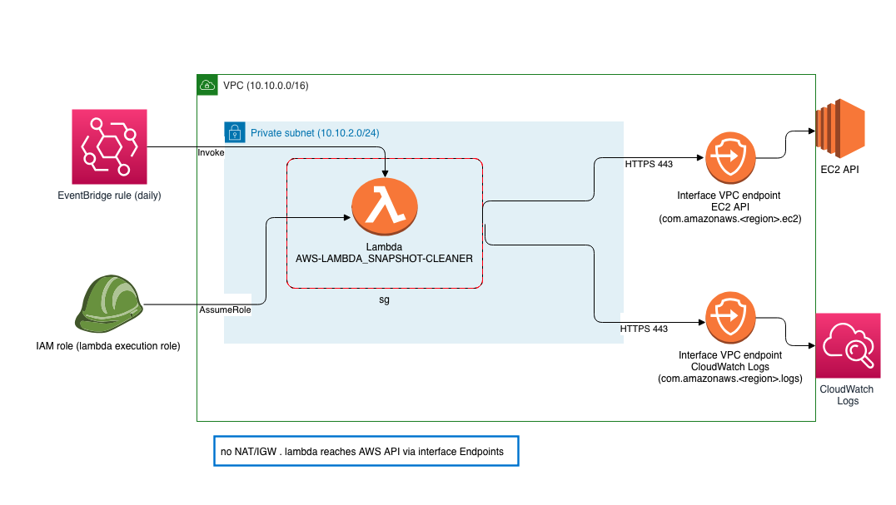

# AWS lambda: snapshot cleaner

## Table of Contents

- [AWS lambda: snapshot cleaner](#aws-lambda-snapshot-cleaner)
  - [Table of Contents](#table-of-contents)
  - [About ](#about-)
  - [Assumptions ](#assumptions-)
  - [deployment steps](#deployment-steps)
  - [design diagram](#design-diagram)
  - [Author](#author)

## About <a name = "about"></a>

This Project implements an AWS Lambda function that runs within a specific VPC and automatically deletes EC2 snapshots older than a specified age (default 1 year). (runs inside VPC private subnet and reaches AWS APIs via VPC Interface Endpoints)

This is written in a modular fashion and components of it can be used in different project beyond the original scope.

all key variables and settings are added to the included `Makefile` to provide **one place** to make changes if desired.

## Assumptions <a name = "assumptions"></a>

- AWS region: `us-west-2`
- shell: `zsh`
- IaC tool: `terraform`
- you have `aws-cli` installed with a config profile that has appropriate permissions to make changes.
- centralizing variables, knobs, settings in to a single location. In this case `Makefile`
- For any variables that could cause **unsafe** behaviour if misconfigured, do **not** set a default and allow terraform to back out due to lack of set value. (document it in `vars.tf` and point to the `Makefile` so failures are loud, not silent)
- Favour Terraform `aws_iam_policy_document` over JSON blobs for policies
- help future reader by documenting intent in code
- add guard rails/safe guards as possible.

## deployment steps

1. make sure you have `terraform` and `aws-cli` installed. and have configured profile with correct permissions in `.aws` directory.
2. add the name of profile to use in the `Makefile` (clearly labeled)
3. validate your profile at least once by running `make aws-whoami` in the same directory as the `Makefile`.  
4. run `make plan` to see expected changes and possible issues
5. run `make apply` when you are ready to deploy
6. run `make destroy` when you want to tear down all created infrastructure
7. run  `make help` to get more info and following additional options

```sh
> make help
#################################
  AWS-LAMBDA_SNAPSHOT-CLEANER
#################################
Usage:
 make help: show this screen
 make aws-whoami: verify which AWS profile is being used
 make clean: remove .terraform dir
 make show-vars: show current variables
 make check-vars: sanity check. give a chance to back out
 make init: clean. initialize terraform (keeps terraform state)
 make remove-state: remove terraform state
 make plan: dry run terraform plan ( it will update lambda.zip file)
 make apply: deploy terraform changes and create/update resources
 make destroy: destroy all previosly created resources
 ```

## design diagram


  
## Author

jafarih
